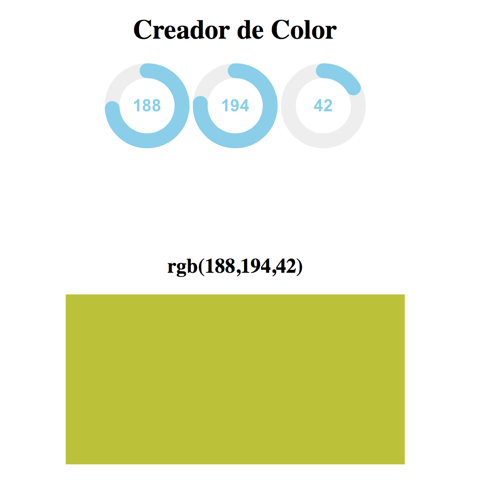

# Experiencia 24 - Actividad Presencial I
## jQuery

El objetivo de esta actividad es aprender a implementar el plugin **Knob** en un proyecto en **Ruby On Rails**. Para ello debes leer la documentación oficial y seguir las instrucciones de la actividad.

#### Para realizar esta actividad debes haber visto los videos correspondientes a la semana 24.

## Ejercicio 1:

[jQuery-Knob](http://anthonyterrien.com/knob/) es una biblioteca que permite manejar los input de manera circular y que podemos manipular con el mouse.

Puedes revisar un demo [aquí](http://anthonyterrien.com/demo/knob/)

### Para esta actividad deberas crear un RGB Color Picker.

Se requiere lo siguiente:

- Crear una vista que contenga 3 inputs de tipo Knob.
- Cada input corresponderá a un valor, es decir, uno para **red**, **green** y **blue**.
	- Al modificar un input, el valor RGB debe cambiar sólo el correspondiente a ese input.
- A continuación debes agregar un texto que represente el valor de cada input.
- Finalmente agregar un div que cambie de color de acuerdo al cambio de valores de los input.

Imagen de referencia:

